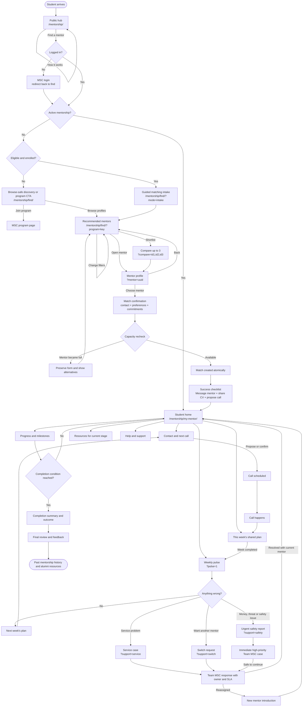
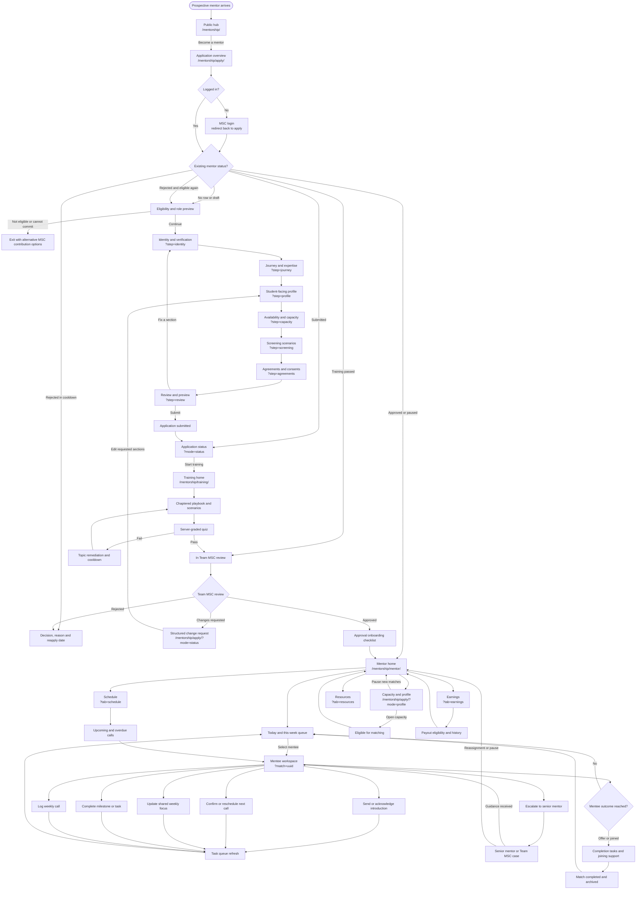
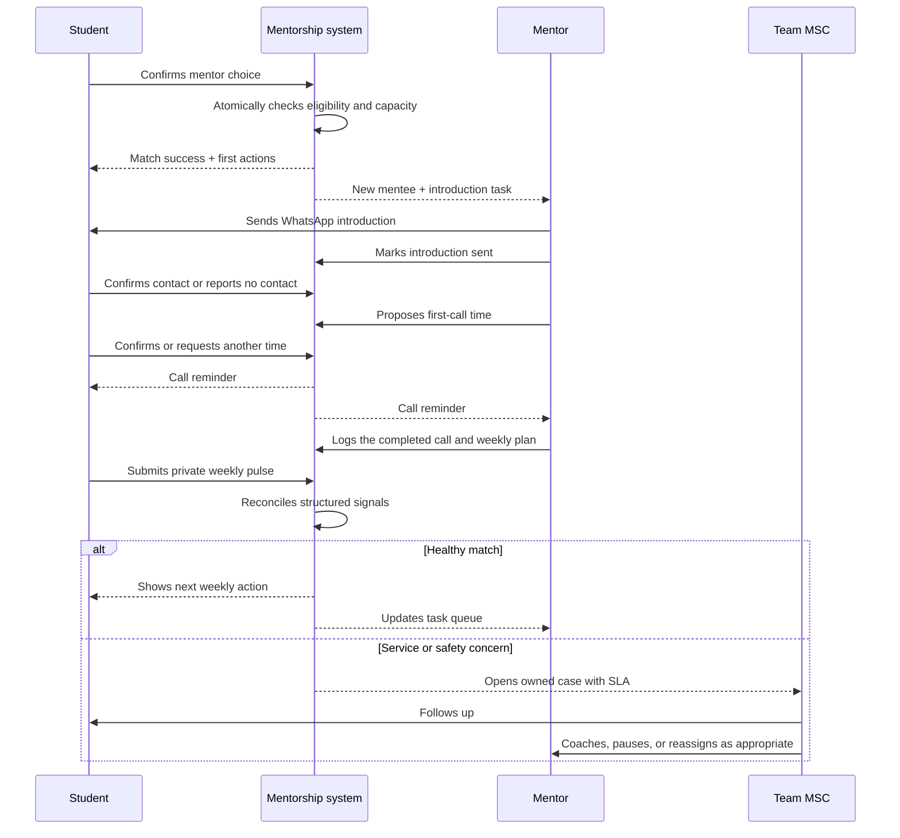

# MSC Mentorship Product & Architectural Revamp Blueprint

**Status:** Product direction and build masterplan
**Date:** 8 October 2026
**Scope:** `/mentorship/` hub, mentor discovery, student workspace, mentor application, training, mentor workspace, admin operations, shared frontend foundation, and `supabase/mentorship/*` contracts
**Constraints:** Repository and supplied screenshots were audited without running a browser or Playwright. The rebuild must use plain HTML, CSS, and browser JavaScript only. No frontend framework, TypeScript, JSX, bundler, or required compilation step. A Worker may be used only where trusted server-side execution is justified.

## 1. Executive verdict

The prototype proves the operating model. It does not yet feel like a product students or mentors will live in every week.

The strongest parts are beneath the UI: privacy boundaries, deny-by-default database access, server-side quiz grading, race-safe booking, role and status contracts, mentor capacity, switch handling, weekly pulse data, review moderation, payouts, audit events, and a localhost mock engine. These should be retained and evolved.

The frontend should be rebuilt rather than cosmetically restyled. The current experience is a collection of long pages, cards, modals, and large page scripts. The same visual weight is applied to primary work, policy explanations, secondary resources, and administrative metadata. On desktop, content is often constrained to `1120px`, the application to `760px`, and profile modals to `820px`, producing large unused gutters on a 1440px screen while dense work is forced into narrow columns. On mobile, the system technically fits, but it remains information-heavy and lacks a truly mobile task model.

The flagship product should be built around one promise:

> Every participant always knows what happens next, who owns it, and when Team MSC will step in.

### Strategic recommendation

Build an isolated Mentorship application at `/mentorship/` using semantic HTML, modern CSS, and native JavaScript ES modules, while retaining Supabase and the existing secure RPC model during migration. Rework the product as six domain modules—onboarding, discovery, matching, active mentorship, mentor operations, and staff operations—rather than seven monolithic page scripts.

Do not rewrite the database first. Add a documented and runtime-validated v2 contract over the sound parts, introduce missing domain concepts through additive migrations, and retire legacy RPCs only after equivalent vertical slices are live.

“HTML, CSS, and JavaScript only” is a technology constraint, not a reason to create one 10,000-line JavaScript file. The browser can load native ES modules directly. Files should remain small and domain-focused while all shipped frontend files stay `.html`, `.css`, or `.js`.

## 2. Audit basis

The review covered:

- `mentorship/SPEC.md` and `MENTORSHIP-SUMMARY.md`.
- `mentorship/assets/mentorship-core.js`, `mentorship/assets/mentorship.css`, and `mentorship/assets/mock-data.js`.
- All seven product surfaces and their page-specific JavaScript and CSS.
- The split admin modules, mentor shared helpers, mock status helpers, and current route/mock tests.
- `supabase/mentorship/001_mentorship.sql`, rollback, verification script, and schema README.
- The supplied 1440-class desktop screenshots for the hub and mentor application.
- Prototype origin commit `2abf78a1f`.

## 3. What is good and should survive

### Product model

- Clear participant roles: student, mentor, senior mentor, and admin.
- A comprehensible mentor lifecycle: draft → submitted → training passed → approved/rejected/paused.
- A real service promise: fast WhatsApp response, weekly call, CV review, mock interview, and joining help.
- Safety language consistently rejects fees, selling, poaching, and placement promises.
- Mentorship is attached to a program, allowing Industrial Training now and other MSC programs later.
- Students choose rather than being silently assigned, while staff retain manual assignment and reassignment powers.
- Weekly pulse, review, switch, checklist, and call-log mechanisms create useful service-quality signals.

### Engineering model

- All mentorship tables use RLS and deny direct `anon`/`authenticated` table access.
- Writes are centralized in `SECURITY DEFINER` RPCs.
- Contact details are withheld until an active match.
- Booking locks mentor capacity and a partial unique index prevents two active mentors for one student/program.
- Quiz answers never reach client code and grading is server-side.
- Storage separates public mentor photos from private CVs.
- Transactional mail triggers fail open, so mail outages do not block product actions.
- The mock engine exposes meaningful personas and closed-match cases.
- CSV formula injection is considered.

These are foundational assets. The rebuild should preserve their intent even when names and APIs change.

## 4. What is not good enough

### 4.1 Desktop and layout deficiencies

1. **The shell is too narrow for operational work.** The base container is `1120px`; the sub-navigation and footer use the same width. At 1440px this leaves broad gutters while dashboards, filters, data tables, and admin controls compete for space.
2. **The application form is an isolated narrow tower.** Its `760px` maximum width creates a very long page and gives no persistent desktop context. The supplied screenshot shows a small form island surrounded by empty space.
3. **The hub is long but not progressive.** It stacks many similar white cards: how it works, duties, safety, staff oversight, mentor recruitment, FAQ, and final CTA. The content is useful, but there is no strong narrative rhythm or proof layer.
4. **Authenticated work is presented like a marketing page.** Full site header, mentorship subnav, wide hero, and footer remain visible even on task-heavy pages. This consumes vertical space and weakens the sense of a dedicated product.
5. **Modals carry primary workflows.** Mentor profiles, booking, call logging, switch requests, reviews, reassignment, and application review all use modal/sheet patterns. Large, multi-step, or deep-linkable work should have routes or drawers with stable URLs.
6. **Cards are the default for everything.** Cards do not communicate hierarchy when every region is a card. Important tasks, reference content, warnings, settings, and metrics become visually equivalent.
7. **Typography is underscaled on desktop.** Many operational labels sit at `0.72–0.9rem`, while large areas of screen remain unused. Density comes from small type rather than strong information design.
8. **The grid system is generic rather than purpose-built.** Repeated auto grids do not reflect each workflow’s decision model—for example, mentor comparison needs consistent columns; a dashboard needs priorities plus supporting context; admin needs queues and detail panes.

### 4.2 Mobile deficiencies

The current implementation is responsive, but “no horizontal scroll” is not the same as a good mobile product.

- Top-level site navigation plus mentorship sub-navigation creates competing navigation layers.
- Many tabs and chips become horizontal scrollers with weak discoverability.
- Forms retain extensive explanatory copy and visibility badges beneath nearly every field, increasing scroll and cognitive load.
- Dashboard cards hide complex detail inside accordions, which makes repeated weekly work slow.
- Tables stack into cards, but the resulting cards remain data-heavy and action-heavy.
- Sticky actions exist, but safe-area behavior, keyboard overlap, and recovery from interrupted uploads need first-class test coverage.
- There is no mobile home focused on “today’s next action.”

### 4.3 Visual and content deficiencies

- The visual language is clean but generic: blue pills, soft backgrounds, white cards, Font Awesome icons, and small badges dominate every surface.
- Status badges are overused and often compete with headings rather than support them.
- Trust is asserted through text (“LinkedIn checked”) but not organized into a coherent trust profile.
- “Hojayega” is warm and distinctive, but it appears as a repeated component instead of an occasional brand moment.
- Empty states explain absence but rarely present a recovery path, expected timing, or service owner.
- Skeletons are generic and do not resemble the final surface.
- Error handling is mostly toast-based; important failures need inline persistence and retry/recovery states.
- Content repeats across the hub, directory, booking flow, student workspace, playbook, and mentor workspace.

### 4.4 Workflow gaps

#### Student discovery and matching

- Filters ask students to know what matters before MSC has taught them how to choose.
- “Recommended” is a Bayesian rating plus availability, not a transparent compatibility model.
- There is no short guided intake covering target domain, companies, language, call timing, desired support, and mentor seniority.
- No shortlist or side-by-side comparison exists.
- No “why this mentor” explanation is shown.
- Booking jumps from browsing to a commitment modal; there is no confirmation of expectations, preferred first-call times, or alternative if the mentor becomes unavailable.
- No waitlist or “notify me when a suitable mentor opens” state exists.

#### Mentor onboarding

- The 5-step form plus review actually exposes six steps and a very large number of fields before the candidate experiences value.
- Identity, public profile, eligibility evidence, availability, screening, and legal consents are mixed into one flow.
- Twenty-one consent checks create fatigue and encourage blind completion.
- Training begins only after the full application, even though a preview of the role would help candidates self-select earlier.
- Application review has a stated 7-day target but no visible queue position, SLA countdown, requested-changes loop, or in-product notification.
- Rejection supports only a cooldown and reason; there is no structured “changes requested” state.

#### Training and quiz

- The playbook is a long accordion document, not a learning experience.
- Lecture completion is self-attested; there is no chapter progress or resumability.
- Quiz feedback and retry exist, but there are no scenario simulations, practice mode, or focused remediation by topic.
- Passing the quiz does not create a readiness checklist for going live.

#### Active mentorship

- WhatsApp is a launch link, not a tracked introduction. The product cannot reliably tell whether contact was made.
- Call scheduling is absent. “Call every week” depends on two people coordinating externally.
- Call logs prove only that the mentor entered a log; student pulse and mentor log are not reconciled in the UI.
- There is no shared weekly plan, next-call time, action list, document exchange, or structured CV review loop.
- The student’s progress is a mentor-controlled checklist; the student cannot confirm, comment, or see the evidence behind completion.
- A switch request is a free-text support queue, with no emergency/safety branch, cancellation, expected response time, or guided resolution.
- There is no planned completion flow, handoff, alumni follow-up, or final outcome capture beyond checklist ticks.

#### Mentor workspace

- The dashboard is organized by mentee cards rather than daily priority.
- “Today” flags are computed, but there is no unified task queue, snooze, due date, or completion history.
- Mood is encoded into the call-note string, confirming the domain model is incomplete.
- Mentors cannot set or confirm the next call.
- Capacity is a single maximum and accepting toggle; there is no program-specific availability or pause-until date.
- Earnings are informational but the due policy is undefined and dispute/support handling is absent.
- Senior-mentor coaching is reduced to a WhatsApp escalation link and staff note.

#### Admin operations

- Ten tabs flatten fundamentally different jobs into one navigation bar.
- Overview metrics are counts, not service-level indicators or trends.
- Red flags are generated, but there is no triage owner, status, priority, due date, resolution code, or audit-friendly case timeline.
- Application review is a very wide modal rather than a queue-detail workspace.
- Matching is capacity-based; it lacks compatibility scoring, exclusions, workload balancing, and documented rationale.
- Reassignment/end reasons can leak through switch resolution text.
- Payouts are manually marked with no eligibility rule, reconciliation import, approvals, or exceptions queue.
- Senior mentors can access broad exports containing contacts; least-privilege access needs refinement.
- Rejected applicant photos/CVs have no retention policy or cleanup job.

### 4.5 Frontend architecture deficiencies

- `mentorship-core.js` combines constants, authentication, API calls, validation, date formatting, storage, DOM rendering, modal management, shell markup, analytics, and mocks in roughly 1,500 lines.
- `apply.js` is roughly 1,574 lines and owns the schema, form renderer, conditional logic, autosave, validation, upload flow, review, submit, and edit mode.
- `my-mentor.js`, `find.js`, and `mentor.js` each combine domain rules, state, rendering, routing, and mutations.
- The system has no static typing across JavaScript, RPC payloads, SQL JSON shapes, or mock fixtures.
- HTML is rebuilt with string templates and event delegation. The escaping helper is valuable, but UI state becomes difficult to reason about and test.
- URL state uses manual `history.replaceState`; there is no central router, navigation lifecycle, or back/forward model.
- Fetch cancellation, stale response protection, mutation invalidation, and offline/reconnect behavior are inconsistent.
- Tests validate route configuration and some mock contracts, but not product behavior, accessibility, visual states, or SQL/frontend type agreement.
- The handover reports broad external tests, but the repository itself contains only a small fraction of those checks.

### 4.6 Data and contract gaps

The schema is secure and capable, but several product concepts are either missing or encoded indirectly:

- Appointment/availability and rescheduling.
- Acknowledged introduction/contact event.
- Shared action plans and task ownership.
- Structured wellbeing/mood instead of a note prefix.
- Support/safety cases with owner, severity, SLA, and resolution.
- Notifications with read state and preferred channel.
- Match health snapshots and reasons behind risk scores.
- Program-specific capacity and availability windows.
- Application “changes requested” and review checkpoints.
- Payout eligibility and dispute state.
- Data retention/deletion jobs for rejected applicants.
- Explicit consent/version records rather than a JSON consent map only.

## 5. Product north star and principles

### North-star outcome

An enrolled student is matched with a suitable mentor, makes first contact within 24 hours, completes a useful first call within 7 days, and continues a visible weekly rhythm until a defined completion outcome.

### Principles

1. **Next action over feature navigation.** Home surfaces show the one or two actions that matter now.
2. **Trust before choice.** Explain who mentors are, what is checked, what is not guaranteed, and why a recommendation fits.
3. **Structured coordination, human conversation.** WhatsApp remains the conversation channel; MSC owns scheduling, milestones, safety, and accountability.
4. **Progress belongs to both people.** Mentor and student share the plan, while private staff signals remain private.
5. **Every promise needs an escalation path.** Each SLA has a visible owner and fallback.
6. **Operational states are explicit.** Avoid encoding product facts in notes or inferring them from unrelated timestamps.
7. **Mobile is task-first; desktop is context-rich.** The same information hierarchy should adapt, not merely stack.
8. **Safety and privacy are product features.** Contact visibility, report flows, role permissions, and retention are designed and tested.

## 6. Target information architecture

The static hosting model remains folder-based. Major surfaces use their existing `folder/index.html` route, and deep state uses query parameters or anchors. No dynamic path segments or SPA fallback are required.

### Public

- `/mentorship/` — product story, trust, how it works, mentor value proposition, FAQ.
- `/mentorship/find/` — optional public, privacy-safe browse mode if the directory-visibility decision is approved; login is still required to shortlist or match.

### Student app

- `/mentorship/my-mentor/` — next action, mentor contact, next call, this week’s plan, and progress.
- `/mentorship/find/?mode=intake&program=<key>` — guided matching intake.
- `/mentorship/find/?program=<key>` — recommendations plus search/filter directory.
- `/mentorship/find/?mentor=<uuid>` — deep-linked mentor profile sheet/page state.
- `/mentorship/find/?compare=<uuid>,<uuid>` — shortlist comparison.
- `/mentorship/my-mentor/?program=<key>&pulse=1` — weekly pulse opened and focused.
- `/mentorship/my-mentor/?program=<key>&support=switch|service|safety` — the correct support path opened with its SLA.

### Mentor app

- `/mentorship/mentor/` — priority queue, schedule, capacity, and service health.
- `/mentorship/mentor/?match=<uuid>` — one mentee workspace expanded and focused.
- `/mentorship/mentor/?tab=mentees|schedule|earnings|resources` — primary mentor work areas.
- `/mentorship/training/#<chapter>` — chaptered course and assessment.
- `/mentorship/apply/?mode=profile` — profile, availability, and capacity editing after approval.

### Mentor candidate

- `/mentorship/apply/` — application overview and eligibility.
- `/mentorship/apply/?step=identity|journey|profile|capacity|screening|agreements|review` — application sections.
- `/mentorship/apply/?mode=status` — status, requests from Team MSC, training progress, and decision.

### Operations

- `/mentorship/admin/` — command center.
- `/mentorship/admin/?area=applications&mentor=<uuid>` — queue-detail application review.
- `/mentorship/admin/?area=matches&match=<uuid>` — match timeline and interventions.
- `/mentorship/admin/?area=cases&case=<uuid>` — safety/service case workspace.
- `/mentorship/admin/?area=mentors&mentor=<uuid>` — mentor operations profile.
- `/mentorship/admin/?area=payouts` — eligibility and reconciliation.
- `/mentorship/admin/?area=configuration` — controlled program settings.

### Navigation model

- Public pages keep the MSC website header and footer.
- Authenticated student and mentor areas use a dedicated app shell with compact MSC branding.
- Desktop: left navigation rail, page header, contextual right rail when useful.
- Mobile: bottom navigation for Home, Mentor/Mentees, Discover/Resources, and Profile; contextual actions remain in the page.
- Staff operations use a separate dense console shell and role-scoped navigation.

## 7. Experience blueprint by surface

### 7.1 Hub / landing

**Goal:** convert uncertainty into trust and the correct next step.

Keep the clear promise and WhatsApp illustration. Replace the long card catalogue with:

1. Hero with role-aware primary action and one proof point.
2. “What happens in your first 7 days” timeline.
3. Real mentor profiles or anonymized examples with explicit trust signals.
4. Service promise and safety boundary in one compact section.
5. Outcome stories/testimonials once there is permission and sufficient data.
6. Mentor recruitment module secondary to the student journey.
7. Short FAQ and one final CTA.

At 1440px, use a `1280–1360px` canvas, a 7/5 hero split, and alternating full-bleed bands. Avoid four consecutive grids of equal white cards.

### 7.2 Discover and match

**Goal:** help a first-time mentee make a confident choice in under 10 minutes.

Flow:

1. A 4–6 question “What help do you need?” intake.
2. Three recommended mentors with “Why this fits” explanations.
3. Full directory as a secondary option.
4. Shortlist up to three mentors.
5. Comparison on journey, domains, languages, usual call times, capacity, reviews, and mentoring style.
6. Mentor profile route with stable URL and back-to-results state.
7. Match confirmation capturing WhatsApp, consent, preferred first-call windows, and commitment summary.
8. Atomic capacity recheck; if unavailable, preserve the form and offer the next best alternatives.
9. Success checklist: message mentor, share CV, propose first-call times, open student home.

Recommendation logic should initially be deterministic and explainable. Score exact program, target domain, language, call-window overlap, desired mentor tier, relevant company exposure, and availability. Ratings should break ties, not dominate suitability.

### 7.3 Student home and match workspace

**Goal:** make the weekly relationship easy and safe.

Home hierarchy:

1. Next call and contact actions.
2. This week’s shared focus and tasks.
3. 30-second check-in.
4. Relationship milestones.
5. Resources relevant to the current hunt stage.
6. Help/switch/report controls.

Add:

- Propose/confirm/reschedule call slots; calendar file and WhatsApp reminder.
- Shared weekly goal with mentor/student ownership.
- CV review state: requested → received externally → feedback given → revision checked.
- Student confirmation on key milestones.
- A visible Team MSC response SLA for support and switch requests.
- Separate “I need a different mentor” from “I feel unsafe / money was requested.”
- A completion flow that captures outcome, final review, alumni consent, and next resources.

### 7.4 Mentor application

**Goal:** qualify good mentors without exhausting them.

Use a desktop two-column workspace: `760–840px` form plus `300–360px` contextual rail. The rail shows progress, autosave, estimated section time, what is public/private, and a live profile preview when relevant.

Reframe sections:

1. Eligibility and role preview (2 minutes).
2. Identity and verification.
3. Journey and expertise.
4. Student-facing profile.
5. Availability and capacity.
6. Screening scenarios and conflicts.
7. Agreements, summarized by theme with expandable full terms and explicit acknowledgements.
8. Review and submit.

Improvements:

- Save server-side from the first interaction; local recovery remains fallback only.
- Let candidates leave and return from a status home.
- Provide quality guidance and examples next to biography/headline fields.
- Use structured change requests from reviewers instead of rejection for correctable issues.
- Make visibility a section-level concept, not a badge repeated beneath every input.
- Preserve consent granularity in the data but reduce repetitive presentation.

### 7.5 Training and assessment

**Goal:** produce consistent mentor behavior, not merely a passing score.

Turn the playbook into short chapters:

- The role and boundaries.
- First 24 hours.
- Weekly call.
- CV review.
- Mock interview.
- Motivation and difficult weeks.
- Offer and joining.
- Safety and escalation.
- Tools, privacy, and payouts.

Each chapter ends with a scenario or checklist. Progress is stored. The final assessment combines randomized knowledge questions with 2–3 scenario decisions. Failed attempts return topic-specific remediation. Passing unlocks a “ready for review” checklist.

### 7.6 Mentor workspace

**Goal:** help a mentor serve every mentee reliably in 10–15 minutes per day plus calls.

Desktop layout:

- Left rail: mentees and filters.
- Main: today/this week task queue and selected mentee workspace.
- Right rail: upcoming calls, capacity, senior mentor, and resources.

Core objects:

- Task: type, match, owner, due date, status, source, evidence.
- Appointment: proposed/confirmed/rescheduled/completed/missed.
- Weekly update: mentor log, student pulse, shared focus, private notes.
- Milestone: shared state with participant confirmations.

The mentor should be able to complete all routine work without opening repeated modals. Message templates remain, but the product should record only explicit acknowledgements (“Intro sent”), never infer WhatsApp delivery.

### 7.7 Admin / staff operations

**Goal:** run mentorship by queues, SLAs, and exceptions.

Replace ten flat tabs with five work areas:

1. **Command center:** service health, SLA breaches, trends, and workload.
2. **Applications:** triage, review, changes requested, decision.
3. **Matches:** unmatched queue, active health, switches, completion.
4. **Mentors:** capacity, performance, coaching, availability, status.
5. **Finance & configuration:** payout eligibility/reconciliation, program settings, staff access.

Every red flag becomes a case with severity, owner, status, next action, due date, private notes, and resolution. Application and match detail use route-based split views so staff can navigate, refresh, and share a stable internal link.

Senior mentors should see only assigned mentors/matches by default. Contact exports require explicit admin permission and an audit event.

## 8. Visual design direction

### Product character

Warm, credible, calm, and action-oriented. It should feel more like a trusted coaching workspace than a generic SaaS dashboard.

### Desktop system

- App canvas: maximum `1440px`; working content typically `1240–1360px`.
- Reading measure: `680–760px`; form measure: `760–840px` plus contextual rail.
- Operational layouts use fixed rails with fluid centers, not a single global container.
- Increase base operational text to `15–16px`; reserve 12px for metadata only.
- Use fewer borders and cards; create hierarchy with whitespace, background bands, grouping, and type.
- Reserve blue for primary action/navigation. Use green for completed/healthy, amber for attention, red for safety/blocked, purple for learning/review.
- Replace generic icon repetition with a smaller custom icon vocabulary and meaningful illustrations only where they explain a flow.

### Mobile system at 375px

- 16px side padding; 44px minimum interactive targets.
- One primary task per screen.
- Sticky bottom action never covers focused fields and respects safe areas.
- Bottom app navigation replaces the secondary horizontal nav.
- Filters use a full-screen sheet with applied-summary and clear reset.
- Dense admin workflows are supported for triage, but bulk operations remain desktop-first.

### Required UI states

Every feature must design: loading, empty, success, recoverable error, permission denied, stale data, offline/reconnecting, concurrent change, and completed/archived states.

## 9. Technical architecture

### Recommended frontend approach

Build the new product directly inside `mentorship/` with semantic HTML, CSS, and native JavaScript modules. Do not introduce React, Vue, Angular, TypeScript, JSX, Vite, Webpack, or another required build layer.

Use one lightweight page entry per major surface and small ES modules for reusable behavior:

```text
mentorship/
  index.html                  public hub
  hub.css
  hub.js
  assets/
    mentorship.css            shared tokens, primitives, shells and layouts
    mentorship-core.js        auth, RPC transport, error model and bootstrapping only
    mentorship-contracts.js   runtime response validation and contract versions
    mentorship-router.js      query/deep-link helpers and navigation state
    mentorship-components.js  small reusable renderers
    mentorship-mocks.js       scenario fixtures using production response shapes
  apply/
    index.html
    apply.css
    apply.js
  training/
    index.html
    training.css
    training.js
  find/
    index.html
    find.css
    find.js
  my-mentor/
    index.html
    my-mentor.css
    my-mentor.js
  mentor/
    index.html
    mentor.css
    mentor.js
  admin/
    index.html
    admin.css
    admin.js
```

All browser code ships as readable `.js` modules and runs directly. Each page entry coordinates its workflow; shared files contain cross-page capabilities only. Page entries should normally stay below roughly 600 lines. If a workflow outgrows that boundary, move cohesive behavior into another `.js` module—never back into a global “core” file.

Keep the current Cloudflare Pages/static-site model. Each route remains a folder with an `index.html`; no SPA fallback or compilation step is required. Cache versions can use explicit query strings such as `?v=2` and must be updated in one release checklist.

### Native-JavaScript UI pattern

- Use semantic HTML in each `index.html` for the permanent page shell, metadata, initial landmarks, and no-JavaScript fallback message.
- Render authenticated/dynamic regions with an auto-escaping template helper; never interpolate user content into raw `innerHTML`.
- Use custom events and explicit controller functions rather than a hidden global event bus.
- Prefer progressive enhancement: links remain links, forms remain forms, and JavaScript improves rather than replaces basic semantics.
- Use `AbortController` for route/filter refreshes and discard stale responses.
- Maintain a small request cache keyed by RPC name plus normalized arguments; invalidate it explicitly after mutations.
- Use browser History and query parameters for deep links supported by the static hosting model.
- Keep all product state scoped to a page controller. Only session/config/request-cache state may be shared.
- Runtime-validate important RPC payloads with small handwritten validators in `mentorship-contracts.js`; fail into a recoverable contract-error screen rather than rendering corrupted data.

### State boundaries

- **Server state:** user context, applications, mentors, matches, cases, schedules, check-ins, payouts. Owned by the shared request cache and explicitly invalidated by mutations.
- **URL state:** route, selected program/mentor/match, filters worth sharing.
- **Form state:** local until autosave; validated by shared JavaScript validation functions that mirror server rules.
- **Ephemeral UI state:** open drawer, selected table rows, temporary comparison list.
- Do not create a global store for data already owned by the URL or request cache.

### API strategy

Keep direct table access prohibited. Introduce capability-oriented v2 endpoints/RPCs such as:

- `mentorship_v2_bootstrap(role_context)`
- `mentorship_v2_discovery(program, intake, filters, cursor)`
- `mentorship_v2_create_match(mentor_id, program, student_profile, preferences, idempotency_key)`
- `mentorship_v2_student_home(match_id)`
- `mentorship_v2_mentor_home()`
- `mentorship_v2_ops_queue(queue, filters, cursor)`

Avoid one RPC per UI fragment and avoid giant bootstrap payloads containing every role’s data. Return versioned, documented DTOs that expose only what the caller needs and validate them at runtime in JavaScript. Every mutation gets an idempotency key where duplicate submission would be harmful.

### Worker policy

Supabase RPCs remain the primary application backend. A Cloudflare Worker is allowed only when the browser must not perform the operation directly or when scheduled/asynchronous execution is required.

Use a Worker for:

- Transactional mail/outbox consumption and scheduled reminders.
- API keys or secrets, including any LLM provider key.
- Rate-limited external integrations such as calendar webhooks.
- Scheduled retention/cleanup jobs and notification retries.
- Optional server-generated exports containing sensitive data, with authorization and audit logging.

Do not add a Worker merely to proxy safe Supabase reads. Do not move authorization out of the database unless the Worker has an equally explicit role check and audit trail.

### LLM policy: optional, not required for launch

No core P0 workflow requires an LLM. Mentor selection, approval, safety triage, switching, payouts, reviews, and risk flags must remain deterministic and human-auditable.

If an LLM is tested later, the safest initial use is a **mentor preparation assistant** that generates practice interview questions or rewrites a mentor-authored message from non-sensitive inputs such as program, domain, hunt stage, and desired tone. The mentor must review and explicitly choose to use the output.

Possible later experiments:

- Generate a mock-interview question set from domain and difficulty.
- Turn a mentor’s manually selected bullet points into a supportive WhatsApp draft.
- Explain a training concept using approved MSC source material.
- Summarize structured, non-sensitive operations metrics for staff.

Never send CVs, phone numbers, email addresses, marks, private notes, safety reports, free-text student pulses, or identifiable match history to an LLM. Never let an LLM approve/reject mentors, rank mentors invisibly, resolve safety cases, moderate reviews autonomously, or decide payouts.

Every LLM call must go through a Worker with authentication, role checks, rate limits, a strict input allowlist, structured output validation, prompt/version logging without sensitive content, feature flags, and a non-LLM fallback. The product must remain fully usable when the model or Worker is unavailable.

### Domain modules

1. Identity and authorization.
2. Mentor application and verification.
3. Training and assessment.
4. Discovery and recommendations.
5. Match lifecycle.
6. Scheduling and weekly rhythm.
7. Safety/support cases.
8. Notifications and mail.
9. Payouts.
10. Analytics and audit.

### Additive data model changes

Add new migrations; do not edit the original migration after it has been applied anywhere.

- `mentorship_application_review` — review round, decision, requested changes, reviewer, SLA.
- `mentorship_availability` — mentor/program windows and timezone.
- `mentorship_appointment` — proposed, confirmed, rescheduled, completed, missed.
- `mentorship_task` — relationship tasks and ownership.
- `mentorship_weekly_plan` — shared focus and targets.
- `mentorship_case` and `mentorship_case_event` — support/safety operations.
- `mentorship_notification` — in-product read state and channel metadata.
- `mentorship_match_health` — computed snapshot and explanations.
- `mentorship_payout_event` — eligibility, approval, payment, dispute, reversal.
- `mentorship_consent` — consent key, policy version, timestamp, actor.
- Explicit `mood` on call/update records.

Use a durable event/outbox model for mail and product notifications. Retain the principle that communication failure never rolls back core product actions.

### Authorization

- Student: only own profile, own matches, allowed discovery data.
- Mentor: own application/profile and active or historical assigned matches.
- Senior mentor: only assigned mentor portfolio and associated cases unless elevated.
- Admin: program-wide operations.
- Finance permission should be separable from general admin.
- Contact export and sensitive-document access generate audit events.

### Migration approach

Use a strangler migration:

1. Freeze prototype feature development except critical fixes.
2. Build the new static shell and runtime-validated JavaScript adapters beside the prototype.
3. Ship one vertical slice at a time behind a role/feature flag.
4. Read existing tables through v2 DTOs.
5. Dual-write only when a new entity is needed and the old UI remains live.
6. Move routes to the new app after parity and data verification.
7. Remove obsolete page scripts and v1 RPCs only after an observation window.

## 10. Analytics and success measurement

### Funnel metrics

- Eligible visitor → discovery intake started.
- Intake started → mentor profile viewed → shortlist → match confirmed.
- Mentor application started → submitted → training started → passed → approved.
- Approval → accepting capacity → first mentee.

### Service-quality metrics

- Match to acknowledged introduction within 24 hours.
- Match to completed first call within 7 days.
- Weekly call adherence.
- Weekly pulse completion.
- Student/mentor disagreement between call log and pulse.
- Switch requests and reasons.
- Safety flags and resolution time.
- Mentor capacity utilization and response to new match.
- Completion/outcome and review rate.

### Guardrails

- Do not send PII, free text, phone numbers, or CV metadata to analytics.
- Every event has a documented purpose, owner, allowed properties, and retention.
- Product metrics must distinguish missing data from a negative outcome.

## 11. Quality strategy

### Contract tests

- Validate documented JavaScript DTO shapes against real and mock RPC results.
- Run the same contract fixtures through `mentorship-contracts.js` so mocks cannot silently drift from production payloads.
- Test every role/permission boundary.
- Exercise concurrent booking, capacity, idempotency, switch limits, reassignments, and payout transitions.
- Keep quiz keys out of fixtures that ship to clients.

### Component and workflow tests

- Application autosave/recovery and conditional fields.
- Guided discovery, comparison, mentor-unavailable recovery, and match success.
- Schedule/reschedule/cancel states.
- Pulse, review, switch, safety report, and completion.
- Mentor task queue, checklist, call log, and capacity.
- Admin queue ownership, decision, reassignment, and case resolution.

### Accessibility

- WCAG 2.2 AA target.
- Keyboard and screen-reader checks for routing, drawers, dialogs, tables, steppers, star inputs, and live regions.
- Visible focus, skip links, correct headings, reduced motion, 200% zoom, and non-color status cues.
- Accessibility checks block merge for affected surfaces.

### Responsive and visual QA

Required widths: 320, 375, 768, 1024, 1280, 1440, and 1920.
Required states: each persona, every lifecycle status, long Indian names, maximum copy, empty/large lists, slow response, failed upload, expired session, and concurrent change.

### Performance targets

- Native ES modules loaded only by the page that needs them; no page imports admin or mentor-only code unnecessarily.
- Fast authenticated shell with skeletons matching final layout.
- Cursor pagination for staff queues and large directories.
- Responsive image sizes and upload processing.
- No framework runtime or frontend bundle is required.
- Define measurable Web Vitals and JavaScript-size budgets during foundation work and enforce them in CI.

## 12. Phased delivery plan

Each phase ships a testable vertical outcome. Do not build all foundations, then all screens, then all APIs.

### Phase 0 — Product decisions and service rules

**Outcome:** no ambiguous policy remains inside implementation.

- Confirm directory visibility.
- Define mentor eligibility by program.
- Define application review SLA and “changes requested” policy.
- Define first-contact and first-call SLAs.
- Define switch versus safety escalation flows.
- Define completion statuses and outcomes.
- Define payout eligibility, approval, and dispute policy.
- Define senior mentor scope and contact-export policy.
- Define retention for rejected applications and private files.

**Gate:** signed service blueprint, state diagrams, permission matrix, and metric definitions.

### Phase 1 — Product foundation and shell

**Outcome:** new app can safely host production vertical slices.

- Static `index.html` page shells, native ES-module loading, and authenticated/public/staff navigation patterns.
- Design tokens, primitives, layout templates, responsive navigation.
- Runtime-validated RPC adapter, request-cache/mutation conventions, error model, and observability.
- Scenario-based mock layer sharing the same DTOs.
- CI for JavaScript syntax/lint checks, unit tests, contract tests, accessibility smoke, and static route validation.
- Feature flags and v1/v2 route coexistence.

**Gate:** shell works for all roles; no PII in logs/analytics; 375px and 1440px reference layouts approved.

### Phase 2 — Mentor acquisition, application, and training

**Outcome:** a candidate can become review-ready with clear status and recovery.

- Eligibility preview and application status home.
- Sectioned autosaving application and uploads.
- Public profile preview.
- Structured agreements/consents.
- Chaptered training and server-graded assessment.
- Staff application queue, review detail, changes requested, approve/reject.
- Mail/in-product notifications for submission, change request, approval, rejection.

**Gate:** end-to-end candidate journey, permission tests, interrupted-session recovery, and admin audit trail pass.

### Phase 3 — Student discovery and matching

**Outcome:** an eligible student can understand, compare, and confidently match.

- Guided intake and explainable recommendations.
- Directory, filters, shortlist, comparison, routed mentor profiles.
- Booking preferences and commitments.
- Atomic booking with idempotency and mentor-unavailable recovery.
- Match success checklist and notifications.
- Waitlist/fallback when no suitable capacity exists.

**Gate:** concurrent booking tests, contact privacy tests, and recommendation explanation review pass.

### Phase 4 — Active student experience

**Outcome:** a student can manage the relationship week by week.

- Student home and match workspace.
- Introduction acknowledgement.
- Appointment proposal/confirmation/rescheduling.
- Shared weekly focus and milestone states.
- Pulse, review, resources, completion.
- Separate switch, service complaint, and urgent safety paths.

**Gate:** first-contact/first-call SLA instrumentation and support-case routing proven.

### Phase 5 — Mentor operating workspace

**Outcome:** mentors can reliably serve a portfolio from a task-first dashboard.

- Today/this-week queue.
- Mentee workspace, tasks, calls, shared plans, milestones, templates.
- Schedule and reminders.
- Program-specific capacity and pause windows.
- Senior mentor escalation/coaching.
- Earnings eligibility and history.

**Gate:** a mentor with 10 mentees can identify overdue work and update a weekly call without navigation ambiguity.

### Phase 6 — Staff command center

**Outcome:** Team MSC can operate by exception with accountability.

- Service health dashboard and trends.
- Unmatched and matching workbench.
- Match-health queue and case management.
- Switch/reassignment/completion workflows.
- Mentor portfolio and coaching view.
- Payout eligibility, bulk approval, payment reconciliation, and exceptions.
- Role-scoped staff and configuration management.

**Gate:** every intervention has owner, timestamp, reason, and resolution; senior mentor permissions pass least-privilege review.

### Phase 7 — Hardening, migration, and launch

**Outcome:** v2 replaces the prototype safely.

- Data migration/backfill and reconciliation reports.
- Full accessibility, security, privacy, and retention audit.
- Load/concurrency tests for discovery and booking.
- Notification reliability and replay tooling.
- Operational runbooks, support macros, and incident ownership.
- Controlled cohort rollout; compare v1/v2 funnels and service quality.
- Route cutover and post-launch observation window.
- Remove obsolete frontend and RPCs only after rollback risk is low.

**Gate:** launch checklist signed by product, engineering, operations, and privacy/security owners.

## 13. Priority scope

### P0 — Required for a credible flagship release

- New app shell and information architecture.
- Guided discovery and explainable matching.
- Routed mentor profiles and comparison.
- Reworked application, training, and review loop.
- Student home, next call, pulse, milestones, support/safety.
- Mentor task queue and mentee workspace.
- Staff application, matching, service-case, and payout workflows.
- Documented/runtime-validated contracts, role tests, analytics, accessibility, and observability.

### P1 — High-value follow-up

- Calendar integration beyond downloadable invites.
- In-product notification center.
- Waitlist optimization and capacity forecasting.
- Mentor coaching scorecards.
- Outcome stories/testimonials with consent.
- Finance reconciliation import/export and dispute handling.

### P2 — Defer until service volume proves the need

- Real-time in-app chat.
- Video calling.
- AI-generated mentor matching.
- Automated CV document exchange/storage in mentorship.
- Gamification, streaks, leaderboards, or public mentor rankings.
- Native mobile app.

WhatsApp should remain the conversation channel for the first flagship release; rebuilding messaging would add cost without solving the central coordination problem.

## 14. Key risks and mitigations

| Risk | Mitigation |
|---|---|
| Rebuild becomes a visual redesign only | Phase gates are service outcomes and state transitions, not screen completion. |
| Plain JavaScript grows back into monolithic files | Enforce domain-focused ES modules, page-size budgets, contract tests, and strict ownership boundaries. |
| Static pages duplicate shell markup | Keep a small, stable shell renderer and shared CSS tokens; page HTML retains semantic landmarks and fallback content. |
| Optional Worker or LLM becomes a critical dependency | Core journeys must have deterministic Supabase/browser paths and remain usable when the Worker or model is unavailable. |
| v1/v2 data drift | Versioned DTOs, additive migrations, reconciliation scripts, and minimal dual-write windows. |
| Operations cannot sustain new promises | Confirm SLAs, queue ownership, and staffing in Phase 0. |
| Recommendation feels opaque or biased | Deterministic scoring with visible “why,” audited weights, and manual browse always available. |
| Sensitive contact leakage | Least-privilege DTOs, permission tests, audited exports, and no PII analytics. |
| Mentor logs do not reflect reality | Compare mentor log with student pulse; treat discrepancies as signals, not accusations. |
| Long rebuild delays learning | Ship vertical slices behind flags and test with cohorts. |

## 15. Decisions required before detailed implementation specs

1. Is mentor discovery public, login-only, or public-preview/login-to-contact?
2. Is a student allowed to shortlist/contact before enrollment, or only browse?
3. Who owns first-contact and first-call SLA breaches?
4. What conditions make a payout eligible and who approves it?
5. Can senior mentors reassign, resolve service cases, or view/export contacts?
6. What counts as mentorship completion: joining, student exit, program end, or staff decision?
7. Which switch reasons are normal service issues and which trigger an urgent safety case?
8. How long are rejected applicant documents and closed-match contact details retained?
9. Should mentors still in articleship be eligible for Industrial Training mentees?
10. What is the initial cohort size and who provides operational coverage during rollout?

## 16. Definition of done for every vertical slice

A slice is not done when the screen looks finished. It is done when:

- Happy path and all lifecycle states are implemented.
- Permissions and contact visibility are tested server-side.
- Loading, empty, error, retry, stale, concurrent, and completed states exist.
- 375px and 1440px designs are approved; supported width matrix passes.
- Keyboard and screen-reader behavior passes the accessibility checklist.
- Analytics events contain no PII and have documented ownership.
- Notifications are idempotent and replayable.
- Operations have a queue, owner, SLA, and runbook for failures.
- Contract, component, workflow, and database tests pass in CI.
- Migration and rollback behavior are documented.

## 17. Immediate next planning sequence

1. Run a two-hour product-policy workshop to close the ten decisions above.
2. Produce the canonical lifecycle diagrams for application, match, appointment, support case, and payout.
3. Create a permission/data-visibility matrix for every role and match state.
4. Wireframe only the four backbone workspaces at 375px and 1440px: student home, discovery, mentor home, and ops command center.
5. Validate those wireframes with 5–8 current students, 3–5 prospective mentors, and the Team MSC operator who handles escalations.
6. Finalize the v2 information architecture and design tokens.
7. Write separate implementation specs and plans for the seven delivery phases rather than one giant engineering plan.

The first implementation spec should cover **Phase 1: product foundation and shell**. Discovery, onboarding, active mentorship, mentor operations, and staff operations should each receive their own approved spec and testable implementation plan.

## 18. Full user workflow and page-navigation examples

These diagrams show the intended navigation and lifecycle, not merely the happy path. URLs deliberately follow the static folder plus query-parameter model.

### 18.1 Student workflow



#### Student navigation example

**Before matching**

- Desktop primary navigation: `Overview`, `Find a mentor`, `My mentor`.
- Mobile bottom navigation: `Home`, `Find`, `My mentor`, `Profile`.
- “Find” first opens the guided intake for an eligible student; “Browse all” reveals the directory.

**After matching**

- Desktop primary navigation: `Home`, `My mentor`, `Resources`, `Help`.
- Mobile bottom navigation: `Home`, `Mentor`, `Plan`, `Help`.
- The Home screen opens on the next required action, not a generic dashboard.
- Discovery remains reachable but booking is disabled for a program with an active or completed mentorship.

#### Student page sequence example

```text
/mentorship/
  → /login.html?redirect=/mentorship/find/?mode=intake
  → /mentorship/find/?mode=intake&program=industrial-training
  → /mentorship/find/?program=industrial-training
  → /mentorship/find/?compare=mentor-a,mentor-b
  → /mentorship/find/?mentor=mentor-a
  → match confirmation state on /mentorship/find/
  → /mentorship/my-mentor/?program=industrial-training
  → /mentorship/my-mentor/?program=industrial-training&pulse=1
```

### 18.2 Mentor workflow



#### Mentor navigation example

**Candidate state**

- Desktop primary navigation: `Application`, `Training`, `Status`.
- Mobile bottom navigation: `Application`, `Training`, `Status`.
- The active destination changes with status; locked destinations explain the requirement instead of disappearing.

**Approved mentor state**

- Desktop app navigation: `Home`, `Mentees`, `Schedule`, `Earnings`, `Resources`, `Profile`.
- Mobile bottom navigation: `Home`, `Mentees`, `Schedule`, `More`.
- Home is the task queue. Selecting a task opens the relevant mentee workspace directly.
- Profile and capacity editing remain in `/mentorship/apply/?mode=profile` so the public-profile form has one owner.

#### Mentor page sequence example

```text
/mentorship/
  → /mentorship/apply/
  → /mentorship/apply/?step=identity
  → /mentorship/apply/?step=journey
  → /mentorship/apply/?step=profile
  → /mentorship/apply/?step=capacity
  → /mentorship/apply/?step=screening
  → /mentorship/apply/?step=agreements
  → /mentorship/apply/?step=review
  → /mentorship/training/#role
  → /mentorship/training/#assessment
  → /mentorship/apply/?mode=status
  → /mentorship/mentor/
  → /mentorship/mentor/?match=active-match-id
  → /mentorship/mentor/?tab=schedule
  → /mentorship/mentor/?tab=earnings
```

### 18.3 Cross-role handoff



The sequence deliberately keeps WhatsApp as the conversation channel while the portal owns accountability, scheduling state, milestones, private feedback, and escalation.
